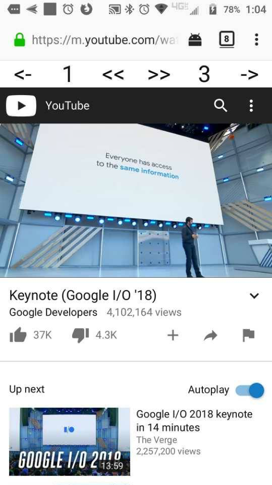

# YouTube-Moble-Helper
An extension to help users manipulate Youtube video playback rate and time on mobile

## Prerequisites
This application should be used with the Firefox browser, which allows add-ons on mobile.

## Installation
### As temporary add-on
1) Clone this repo
2) Load the "src" directory as a temporary add-on as described in [Temporary installation in Firefox](https://developer.mozilla.org/en-US/docs/Mozilla/Add-ons/WebExtensions/Temporary_Installation_in_Firefox)

### From Firefox Add-ons Explorer
1) install from [Firefox Add-ons Explorer](https://addons.mozilla.org/en-US/firefox/addon/youtube-mobile-helper/)

## Usage
Video playback rate and time controls will be added to the page as shown below.
Control actions: 
<-  go back 10 seconds 
1   set playback rate to 1 (normal speed) 
<<  decreate playback rate by 0.5 
\>> increate playback rate by 0.5 
3   set playback rate to 3 
->  go forward 10 seconds 

